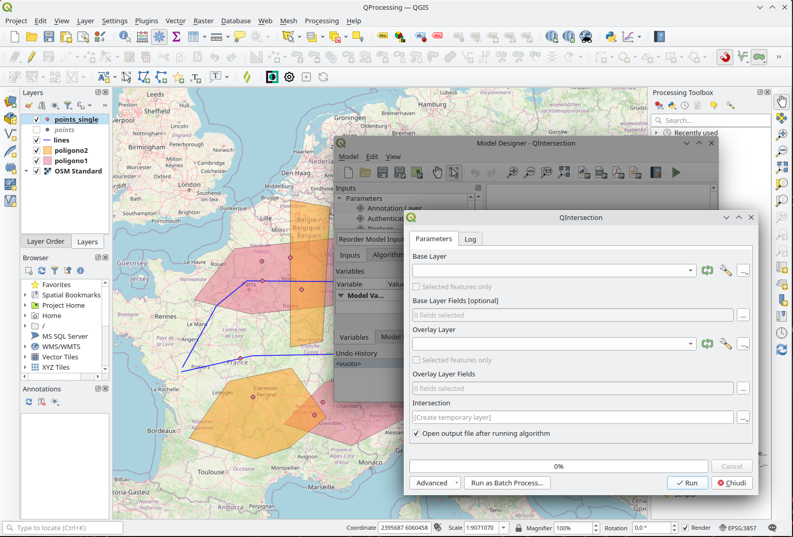
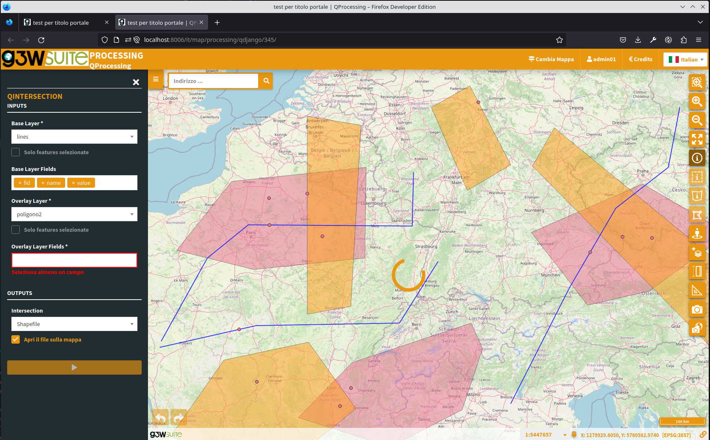

# G3W-ADMIN-QPROCESSING v1.2.1-beta.0

A dedicated [QGIS Processing](https://docs.qgis.org/3.28/en/docs/training_manual/processing/index.html) module for G3W-SUITE framework:

1. upload a [`.model3`](https://docs.qgis.org/3.28/en/docs/user_manual/processing/modeler.html) file into G3W-ADMIN.
2. get QGIS Processing tools available within G3W-CLIENT.





## Supported features

#### QGIS Processing Inputs:

- **VectorLayer** → [QgsProcessingParameterVectorLayer](https://qgis.org/pyqgis/3.2/core/Processing/QgsProcessingParameterVectorLayer.html)
- **VectorFeatures** → [QgsProcessingParameterFeatureSource](https://qgis.org/pyqgis/3.2/core/Processing/QgsProcessingParameterFeatureSource.html)
- **VectorField** → [QgsProcessingParameterField](https://qgis.org/pyqgis/3.2/core/Processing/QgsProcessingParameterField.html)
- **RasterLayer** → [QgsProcessingParameterRasterLayer](https://qgis.org/pyqgis/3.2/core/Processing/QgsProcessingParameterRasterLayer.html)
- **Distance** → [QgsProcessingParameterDistance](https://qgis.org/pyqgis/3.2/core/Processing/QgsProcessingParameterDistance.html) 
- **DateTime** → [QgsProcessingParameterDateTime](https://api.qgis.org/api/classQgsProcessingParameterDateTime.html) 
- **Boolean** → [QgsProcessingParameterBoolean](https://qgis.org/pyqgis/3.2/core/Processing/QgsProcessingParameterBoolean.html)
- **Range** → [QgsProcessingParameterRange](https://qgis.org/pyqgis/3.2/core/Processing/QgsProcessingParameterRange.html) 
- **Number** → [QgsProcessingParameterNumber](https://qgis.org/pyqgis/3.2/core/Processing/QgsProcessingParameterNumber.html) 
- **Extent** → [QgsProcessingParameterExtent](https://qgis.org/pyqgis/3.2/core/Processing/QgsProcessingParameterExtent.html)

#### QGIS Processing Outputs:

- **VectorLayer** → [QgsProcessingOutputVectorLayer](https://qgis.org/pyqgis/3.2/core/Processing/QgsProcessingOutputVectorLayer.html)
- **RasterLayer** → [QgsProcessingOutputRasterLayer](https://qgis.org/pyqgis/3.2/core/Processing/QgsProcessingOutputRasterLayer.html)


## Installation

Install *qprocessing* module into [`g3w-admin`](https://github.com/g3w-suite/g3w-admin/tree/v.3.6.x/g3w-admin) applications folder:

```sh
# Install module from github (v1.0.0)
pip3 install git+https://github.com/g3w-suite/g3w-admin-processing.git@v1.0.0

# Install module from github (dev branch)
# pip3 install git+https://github.com/g3w-suite/g3w-admin-processing.git@dev

# Install module from local folder (git development)
# pip3 install -e /g3w-admin/plugins/qprocessing

# Install module from PyPi (not yet available)
# pip3 install g3w-admin-processing
```

Enable `'qprocessing'` module adding it to `G3W_LOCAL_MORE_APPS` list:

```py
# local_settings.py

G3WADMIN_LOCAL_MORE_APPS = [
    ...
    'qprocessing'
    ...
]
```

Refer to [g3w-suite-docker](https://github.com/g3w-suite/g3w-suite-docker) repository for more info about running this on a docker instance.

**NB** On Ubuntu Jammy you could get an `UNKNOWN` package install instead of `g3w-admin-processing`, you can retry installing it as follows to fix it:

```sh
# Fix: https://github.com/pypa/setuptools/issues/3269#issuecomment-1254507377
export DEB_PYTHON_INSTALL_LAYOUT=deb_system

# And then install again the module
pip3 install ...
```

### Configuration

By default `Qprocessing` works sin **synchronous mode** 

To make `QProcessing` works in **asynchronous mode** (in batch mode) you need set  setting `QPROCESSING_ASYNC_RUN` TO `True` and  Huey and have a message broker such as [`Redis`](https://redis.io/), here it is an example:

```python
QPROCESSING_ASYNC_RUN = True 

HUEY = {                                   # Huey implementation to use.
    'huey_class': 'huey.RedisExpireHuey',
    'name': 'g3w-suite',
    'url': 'redis://localhost:6379/?db=0',
    'immediate': False,                    # If True, run synchronously.
    'consumer': {
        'workers': 1,
        'worker_type': 'process',
    },
}
```

Then start huey:
```
python3 manage.py tun_huey -k process
```

#### Other settings:

##### QPROCESSING_ASYNC_RUN
Activate/deactivate the asynchronous mode running models.

##### QPROCESSING_OUTPUT_PATH
Directory to save the processing outputs. Default *'/tmp/'*.

##### QPROCESSING_INPUT_UPLOAD_PATH
Directory to upload the processing inputs. Default same value of  *QPROCESSING_OUTPUT_PATH*.

##### QPROCESSING_OUTPUT_VECTOR_FORMAT_DEFAULT
Default processing output vector format. Default *'geojson'*

##### QPROCESSING_OUTPUT_RASTER_FORMAT_DEFAULT
Default processing output raster format. Default *'tiff'*

##### QPROCESSING_OUTPUT_FILE_FORMAT_DEFAULT
Default processing output file format. Default *'pdf'*

##### QPROCESSING_OUTPUT_HTML_FORMAT_DEFAULT
Default processing output html format. Default *'html'*

##### QPROCESSING_INPUT_SHP_EXTS
List of input shapefile extensions. Default *['shp', 'shx', 'prj', 'dbf', 'shx']*

### QPROCESSING_INPUT_UPLOAD_VECTOR_FORMATS
List of input vector formats to upload. Default:
``` python
[
    {
        'value': 'zip',
        'key': 'Shapefile'
    },
    {
        'value': 'geojson',
        'key': 'GeoJSON'
    },
    {
        'value': 'kml',
        'key': 'KML'
    },
    {
        'value': 'gpkg',
        'key': 'GeoPackage'
    },
    {
        'value': 'sqlite',
        'key': 'Sqlite/Spatialite'
    }

]
```

##### QPROCESSING_OUTPUT_VECTOR_FORMATS
List of output vector formats. Default:
``` python
[
    {
        'value': 'zip',
        'key': 'Shapefile'
    },
    {
        'value': 'geojson',
        'key': 'GeoJSON'
    },
    {
        'value': 'kml',
        'key': 'KML'
    },
    {
        'value': 'gpkg',
        'key': 'GeoPackage'
    }, 
]
```

##### QPROCESSING_OUTPUT_FILE_FORMATS
List of output file formats. Default:
``` python
[
    {
        'value': 'pdf',
        'key': 'PDF'
    },
]
```

##### QPROCESSING_OUTPUT_HTML_FORMATS
List of output html formats. Default:
``` python
[
    {
        'value': 'html',
        'key': 'HTML'
    },
]
```

##### QPROCESSING_OUTPUT_RASTER_FORMATS
List of output raster formats. Default:
``` python
[
    {
        'value': 'vrt',
        'key': 'VRT'
    },
    {
        'value': 'tiff',
        'key': 'TIFF'
    },
    {
        'value': 'png',
        'key': 'PNG'
    },
    {
        'value': 'jpeg',
        'key': 'JPEG'
    },
    {
        'value': 'jpg',
        'key': 'JPG'
    },
]
```

##### QPROCESSING_CRYPTO_KEY
Encryption key for download links.

**Compatibile with:**
[](https://github.com/g3w-suite/g3w-admin/tree/v.3.7.x)
[](https://github.com/g3w-suite/g3w-suite-docker/tree/v3.6.x)

---

**License:** MPL-2
